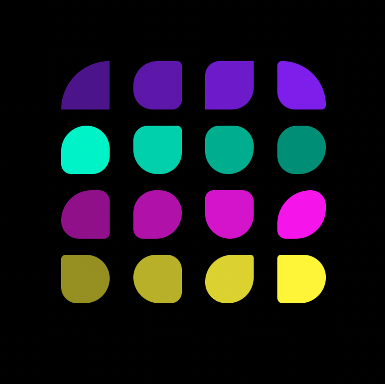

# Corners 
__Objective:__ Practice the use of hexa colors and border-radius properties using __SCSS__, besides of using flexbox for setting the different shapes in columns. 

>Using the next code in HTML: 
```html
<body>
    <div class="Container">
        <div class="purpleContainer">
            <div class="purple1"></div>
            <div class="purple2"></div>
            <div class="purple3"></div>
            <div class="purple4"></div>
        </div>
        <div class="greenContainer">
            <div class="green1"></div>
            <div class="green2"></div>
            <div class="green3"></div>
            <div class="green4"></div>
        </div>
        <div class="pinkContainer">
            <div class="pink1"></div>
            <div class="pink2"></div>
            <div class="pink3"></div>
            <div class="pink4"></div>
        </div>
        <div class="yellowContainer">
            <div class="yellow1"></div>
            <div class="yellow2"></div>
            <div class="yellow3"></div>
            <div class="yellow4"></div>
        </div>
    </div>
</body>
```
>And on SCSS:

```css
body {
    background-color: black;
    text-align: center;
    margin: 25vw;
}

.Container {
    display: flex;
    padding: 1rem;
    flex-direction: column;
    justify-content: center;

}

.purpleContainer {
    display: flex;
    justify-content: space-around;
    padding: 0 2em 2em 2em;
}

.purple1 {
    background-color: #551198;
    width: 6em;
    height: 6em;
    border-radius: 6rem 0 0 0;
}
.purple2 {
    background-color: #6614B6;
    width: 6em;
    height: 6em;
    border-radius: 50% 10% 20% 40%;
}
.purple3 {
    background-color: #7718D5;
    width: 6em;
    height: 6em;
    border-radius: 30% 0 45% 0;
}
.purple4 {
    background-color: #881BF3;
    width: 6em;
    height: 6em;
    border-radius: 10% 6rem 10% 40%;
}

/* Green blocks */
.greenContainer {
    display: flex;
    flex-direction: row-reverse;
    justify-content: space-around;
    padding: 0 2em;
}
.green1 {
    background-color: #119880;
    width: 6em;
    height: 6em;
    border-radius: 55% 60% 75% 50%;
}
.green2 {
    background-color: #14B699;
    width: 6em;
    height: 6em;
    border-radius: 50% 70% 90% 80%;
}
.green3 {
    background-color: #18D5B3;
    width: 6em;
    height: 6em;
    border-radius: 30% 10% 45% 50%;
}
.green4 {
    background-color: #1BF3CC;
    width: 6em;
    height: 6em;
    border-radius: 100% 90% 70% 40%;
}

/* Pink Blocks */ 

.pinkContainer {
    display: flex;
    justify-content: space-around;
    padding: 2em;
}
.pink1 {
    background-color: #981198;
    width: 6em;
    height: 6em;
    border-radius: 85% 30% 15% 50%;
}
.pink2 {
    background-color: #B614B6;
    width: 6em;
    height: 6em;
    border-radius: 70% 70% 80% 30%;
}
.pink3 {
    background-color: #D518D5;
    width: 6em;
    height: 6em;
    border-radius: 30% 40% 85% 90%;
}
.pink4 {
    background-color: #F31BF3;
    width: 6em;
    height: 6em;
    border-radius: 100% 45% 90% 25%;
}

/* Yellow Container */ 
.yellowContainer {
    display: flex;
    justify-content: space-around;
    padding: 0 2em;
}
.yellow1 {
    background-color: #9F9A06;
    width: 6em;
    height: 6em;
    border-radius: 15% 80% 85% 55%;
}
.yellow2 {
    background-color: #BFB907;
    width: 6em;
    height: 6em;
    border-radius: 60% 40% 30% 70%;
}
.yellow3 {
    background-color: #DFD808;
    width: 6em;
    height: 6em;
    border-radius: 90% 10% 85% 70%;
}
.yellow4 {
    background-color: #FFF709;
    width: 6em;
    height: 6em;
    border-radius: 10% 65% 75% 15%;
}
```
Playing around with percentages and different units around each box, so every box will have a different shape between them. 



__Conclusion:__ Using units like percentages for border-radius could be the best when trying to give it a whole new design to an element when looking for something abstract, besides that the hex colors allows to get different shades of the plain colors.
